# git

이곳에서 설명하는 설치 파일 및 실행파일은 오픈 소스로 제공되는 대상으로 설명할 것입니다.

이 책에서 설명하는 설치/실행 파일은 공식 사이트 또는 이미지 사이트에서 `다운로드` 할 수 있으며 `download`폴더에 통합하여 제공하고 있습니다.

명령어는 경로를 나타내는 헤더 구문과 실행 코드 구문으로 이루어져 있으며 아래와 같은 작성법을 기준으로 작성할 것입니다.

```sh
admin@jinhyeok MINGW64 ~/dev/00050 (master) # execute directory (branch)
$ git status # command
```

명령어 부문은 전체 실행 명령어를 보여지며 실습시에는 `$`는 제외하고 작성하도록 합니다.

`git`의 명령어를 나타낼 때에는 아래와 같은 라인태그를 사용하여 나타내도록 합니다

따라서 원하는 라인 태그를 검색 할 때에는 라인태그와 명령어를 검색하도록 합니다.

> git

## git install

깃(`git`)은 오픈소스 기반의 프로그램이며 공식 웹 사이트(**<https://git-scm.com/>**)를 통하여 설치 파일을 다운로드하여 설치할 수 있습니다.


다운로드 버튼은 운영 체제별로 다양하게 제공하고 있으며 윈도우 사용자의 경우 `Download for Windows` 버튼을 선택하여 설치 파일을 다운로드 한 다음 실행하여 설치를 진행하도록 합니다.

## source-tree

`git`을 사용하기 위해서는 `git` 터미널을 사용해야 합니다.

하지만 `git` 터미널(bash, cmd)에 익숙하지 않는 사람은 `gui`방식의 `git`툴인 소스트리를 다운받아 사용하도록 합니다.

소스트리는 개인/기업에 무료로 제공하고 있으므로 공식 사이트(**<https://www.sourcetreeapp.com/>**)에서 다운로드 받아서 설치하도록 합니다.


## git start

설치가 모두 완료 되었으면 단계적으로 `git`을 사용해 보면서 소스 관리 툴을 제대로 다룰 수 있도록 알아 보겠습니다.

### git terminal

깃을 설치 할 때 이런 문구가 선택 되어 있었을 것입니다.

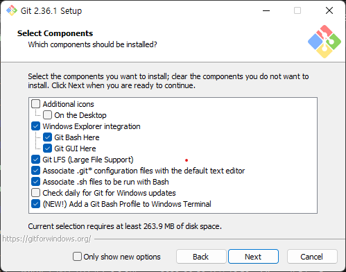

`Window`에서 `git`을 사용하기 위하여 `git-scm`에서는 `git terminal(Git Bash)`를 제공하고 있습니다.

따라서 설치시 `Windows Explorer integration` 항목에 **Git Bash Here**이 선택 되어 있지 않다면 선택하여 `Next` 버튼을 눌러 주도록 합니다.

올바르게 선택이 되었다면 윈도우 버튼을 누른 다음 `git bash`를 입력하면 위와 같은 앱 네비게이션 정보를 확인 할 수 있을 것입니다.

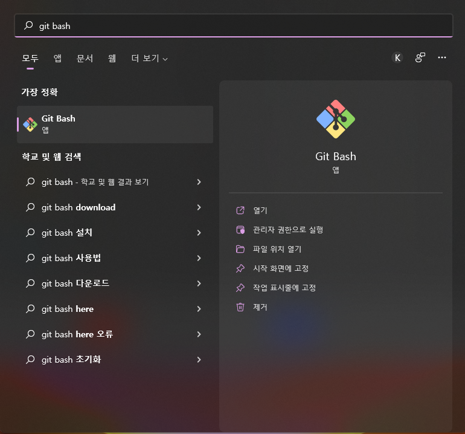

`git gui`는 나중에 다루어 보고 일단 간단하게 `git`을 사용해 보도록 하겠습니다.

### git init

로컬에서 깃을 초기화(설정) 하는 방법은 원하는 폴더로 이동한 다음 `git init` 명령어를 입력하는 일입니다.

- - -

key. `clone`과 `init`

깃을 초기화 하는 방법은 `clone`을 통하는 방법과 `init`을 통하여 초기화 하는 방법이 있습니다.

`git bash`에서 `git` 명령어를 통하면 아래와 같은 명령어를 볼수 있습니다.

> git init

```sh
admin@jinhyeok MINGW64 ~/dev/00010 (master)
$ git
usage: git [--version] [--help] [-C <path>] [-c <name>=<value>]
           [--exec-path[=<path>]] [--html-path] [--man-path] [--info-path]
           [-p | --paginate | -P | --no-pager] [--no-replace-objects] [--bare]
           [--git-dir=<path>] [--work-tree=<path>] [--namespace=<name>]
           [--super-prefix=<path>] [--config-env=<name>=<envvar>]
           <command> [<args>]

These are common Git commands used in various situations:

start a working area (see also: git help tutorial)
   clone     Clone a repository into a new directory
   init      Create an empty Git repository or reinitialize an existing one
```

위 코드는 깃의 `help` 명령어를 확인하기 위하여 출력한 것으로 `git`작업 중 도움이 필요할 경우 `help`명령어를 통하여 도움말을 불러 올 수 있습니다.

```sh
admin@jinhyeok MINGW64 ~/dev/00010 (master)
$ git help init
```

돌아와서 `clone`은 원격 브랜치의 정보를 사용하여 깃을 초기화 하는 방법이며 `init`은 로컬 디렉토리 정보를 사용하여 깃을 초기화 하는 방법입니다.

따라서 `clone`을 하게 되면 원격지의 정보를 같이 가져오게 되므로 원격지와 기본적으로 연결 되어 있는 상태를 나타냅니다.

조금 더 자세한 내용은 `브랜치 > 원격 브랜치`에서 설명하도록 하겠습니다.

- - -

먼저 원하는 작업 디렉토리로 이동한 다음 깃을 초기화 해보도록 하겠습니다.

```sh
admin@jinhyeok MINGW64 ~/dev/00010 (master) 
$ mkdir 100 # 폴더 생성

admin@jinhyeok MINGW64 ~/dev/00010 (master)
$ cd 100 # 작업 영역으로 이동

admin@jinhyeok MINGW64 ~/dev/00010/100 (master)
$ git init # 깃 초기화
Initialized empty Git repository in C:/Users/admin/dev/00010/100/.git/

admin@jinhyeok MINGW64 ~/dev/00010/100 (master)
$ ls .git # 로컬 깃 저장소 확인
HEAD  config  description  hooks  info  objects  refs
```

깃 초기화가 정상적으로 처리 되었으면 다음으로 깃에 `init.html`파일을 추가하고 저정 하겠습니다.

```html
<h1>git init</h1>
```

#### git init with source tree

source-tree 에서 깃을 초기화 하는 방법은 `+Create` 버튼을 선택하여 원하는 작업 경로를 선택하도록 합니다.


모두 선택한 다음 `생성` 버튼을 클릭하여 원하는 장소에 `git`을 초기화 합니다.

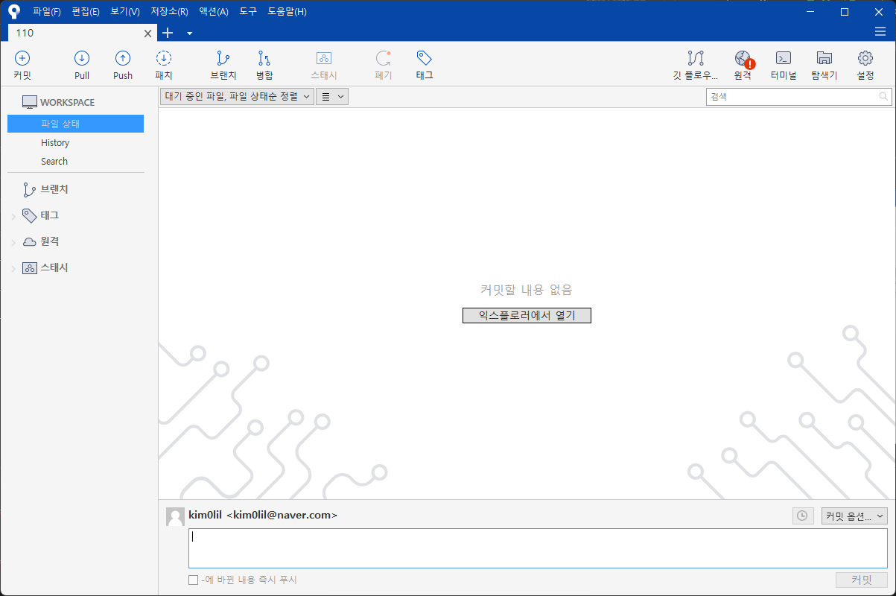

### git config

`git`은 자체적으로 `property`를 등록하기 위해서는 `git config`명령어를 통하여 설정값을 등록 할 수 있습니다.

그중에 대표적인 설정값이 바로 `user.name` 과 `user.email`입니다.

사용자의 고유 인식표를 붙이는 설정값으로써 고유정보를 나태낼때 사용합니다.

`git config`에서 사용 되는 `gitconfig` 파일은는 크게 `3가지` 분류로 구분하고 있습니다.

1. system : `${path}/etc/gitconfig` 파일에서 관리되며 `--system` 옵션을 통하여 적용 됩니다.
2. global : `~/.gitconfig` 파일에서 관리되며 `--global` 옵션을 통하여 적용 됩니다.
3. local : `.git/config` 파일에서 관리되며 `--local` 옵션을 통하여 적용 됩니다.

`3 > 2 > 1` 순서대로 적용 되므로 `local config`가 최우선권을 지니게 됩니다.

먼저 `git config --list`명령문(또는 `-l`옵션)을 통하여 현재 등록된 설정값이 뭐가 있는지 확인해 보겠습니다.

> git config --list
> git config -l

```sh
admin@jinhyeok MINGW64 ~/dev/00010/100 (master)
$ git config --list
diff.astextplain.textconv=astextplain
filter.lfs.clean=git-lfs clean -- %f
filter.lfs.smudge=git-lfs smudge -- %f
filter.lfs.process=git-lfs filter-process

...

```

각 속성값이 등록 된 파일이 궁금하다면 `--show-origin`옵션을 추가하도록 합니다.

> git config --list --show-origin

```sh
$ git config --list --show-origin
file:C:/Program Files/Git/etc/gitconfig diff.astextplain.textconv=astextplain
file:C:/Program Files/Git/etc/gitconfig filter.lfs.clean=git-lfs clean -- %f
file:C:/Program Files/Git/etc/gitconfig filter.lfs.smudge=git-lfs smudge -- %f
file:C:/Program Files/Git/etc/gitconfig filter.lfs.process=git-lfs filter-proces

...

```

`--list` 옵션만을 등록하였을 경우 모든 파일에서 설정값을 가져옵니다.

원하는 영역에서 값을 가져오고 싶을 경우 각 영역의 옵션을 추가하면 됩니다.

> git config --local --list
> git config --global --list
> git config --system --list

```sh
admin@jinhyeok MINGW64 ~/dev/00010/100 (master)
$ git config --local --list
core.repositoryformatversion=0
core.filemode=false
core.bare=false
core.logallrefupdates=true
core.ignorecase=true
```

원하는 파일을 가져올 때는 `--get` 또는 `--get-all`옵션을 추가하면 됩니다.

> git config --get

```sh
admin@jinhyeok MINGW64 ~/dev/00010/100 (master)
$ git config --local --get core.ignorecase
true
```

이제 설정값을 추가해보도록 하겠습니다.

사용자 설정과 관련된 부분들인 `user.name`과 `user.email`은 등록해 보도록 하겠습니다.

먼저 `global`영역에 어떤 설정값이 있는지 확인해 봅니다.

(버전이 바뀌었거나 이미 설정이 되어 있다면 다르게 출력 될 수도 있습니다.)

```sh
admin@jinhyeok MINGW64 ~/dev/00010/100 (master)
$ git config --global --list
core.autocrlf=true
```

`git config`명령문과 `--add`옵션을 사용하여 `user.name`과 `user.email`, `user.unset` 값을 등록한 다음 조회 하도록 하겠습니다.

(깃 허브를 사용한다면 `user.name`과 `user.email`은 깃허브에 등록 된 사용자명과 이메일을 등록하도록 합니다.)

> git config --add

```sh
admin@jinhyeok MINGW64 ~/dev/00010/100 (master)
$ git config --global --add user.name kim0lil

admin@jinhyeok MINGW64 ~/dev/00010/100 (master)
$ git config --global --add user.email kim0lil@naver.com

admin@jinhyeok MINGW64 ~/dev/00010/100 (master)
$ git config --global --add user.unset fake

$ git config --global --list
core.autocrlf=true
user.name=kim0lil
user.email=kim0lil@naver.com
user.unset=fake
```

속성값을 등록할 때 잘못 입력한 경우 삭제하는 것도 필요할 것입니다.

위의 등록 값중 `user.unset`이라는 속성을 제거할 것입니다.

제거할 때는 `--unset` 또는 `--unset-all` 명령문을 사용하여 제거한 다음 확인해 보겠습니다.

> git config --unset
> git config --unset-all

```sh
admin@jinhyeok MINGW64 ~/dev/00010/100 (master)
$ git config --global --unset-all user.unset

admin@jinhyeok MINGW64 ~/dev/00010/100 (master)
$ git config --global --list
core.autocrlf=true
user.name=kim0lil
user.email=kim0lil@naver.com
```

아무런 옵션값을 등록하지 않을 경우 기본적으로 `--add` 옵션값이 적용 됩니다.

`color.ui`가 등록 되어 있지 않는 사람은 아래 명령어를 통하여 등록할 수 있습니다.

`color.ui`에 관한 설정값 또는 `git config`와 관련된 설정 속성들은 공식 문서(**<https://git-scm.com/docs/git-config#Documentation/git-config.txt-colorui>**)를 확인하시기 바랍니다.

```sh
admin@jinhyeok MINGW64 ~/dev/00010/100 (master)
$ git config --global color.ui auto
```

### git status

돌아와서 이전장에서 깃을 초기화 한 다음 파일을 수정하였습니다.

깃을 사용하기 전 먼저 짚고 넘어 가야 할 것이 있습니다.

깃은 기본적으로 아래와 같은 영역의 저장소를 기반으로 동작하고 있습니다.

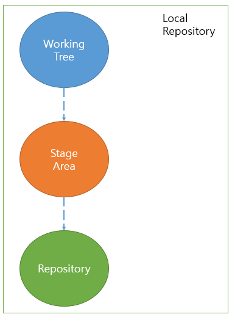

각 영역은 각자의 역활을 맡아서 하고 있습니다.

1. Working Tree : 현재 작업중인 파일 시스템과 연결 되어 있으며 파일 내용 수정 시 파일의 변동 사항을 확인 (또는 `Working Area`)
2. Stage Area : `Working Tree`에서 관리되어 변동 된 내용을 `Repository`의 올리기 전 임의로 저장해 두는 공간
3. Repository : `git`의 설정 정보와 실제 저장 데이터를 관리 하는 공간

따라서 이전에 추가한 파일(`init.html`)은 아직 `Working Tree`에 있다고 볼 수 있습니다.

`git status`의 기본적인 명령어를 사용하여 확인해 보도록 하겠습니다.

(`long` 옵션은 `git status`의 `default`옵션이며 아무것도 등록하지 않을 경우 `long`옵션으로 처리합니다.)

> git status --long

```sh
admin@jinhyeok MINGW64 ~/dev/00010/100 (master)
$ git status --long
On branch master

No commits yet

Untracked files:
  (use "git add <file>..." to include in what will be committed)
        init.html

nothing added to commit but untracked files present (use "git add" to track)
```

`git status`를 통하여 확인한 결과를 설명하자면 `init.html`파일은 현제 `working tree`에 있으며 `untracked` 상태입니다.

- - -

key. git status : `tracking` 과 `untracking`

`git`의 영역중에 `working tree`는 파일 시스템과 연결되어 있다고 말한적이 있습니다.

이 영역에는 다양한 파일이 생성될 가능성이 있습니다.

하지만 모든 파일들을 `git`에서 관리할 것은 아닐 것입니다.

이렇게 관리 되는 파일을 `git`에서는 `tracked` 상태라고 하며 관리되지 않는 파일을 `untracked`상태 라고 합니다.

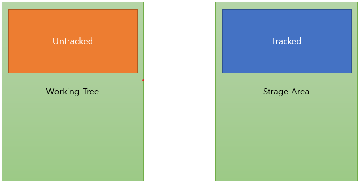

- - -

### git add

현재 `git`에서는 `init.html`파일을 관리하고 있지 않으므로 먼저 `git add`명령어를 통하여 `git`에게 파일을 관리하라는 명령을 합니다.

이렇게 되면 이제 `git`은 `init.html`파일의 변경 사항을 확인하여 관리합니다.

( 관리 한다는 말은 `working tree`영역에서 `stage area`으로 이동한다는 말도 포함 됩니다. )

> git add

```sh
admin@jinhyeok MINGW64 ~/dev/00010/100 (master)
$ git add init.html

admin@jinhyeok MINGW64 ~/dev/00010/100 (master)
$ git status
On branch master

No commits yet

Changes to be committed:
  (use "git rm --cached <file>..." to unstage)
        new file:   init.html
```

이제 `init.html`파일은 `git`이 관리하는 파일 트리에 올라왔습니다.

그림으로 표현하자면 아래와 같습니다.

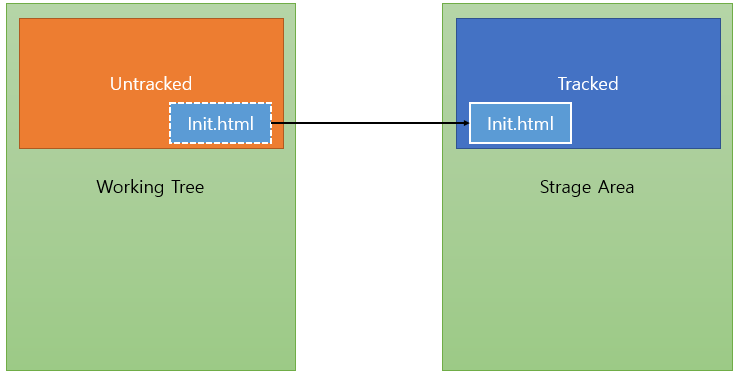

다음으로 `init.html`파일은 한번 수정해 보도록 하겠습니다.

```html
<h1>git init</h1>
<h2>update tracking file</h2>
```

`init.html`파일을 수정하여 변동 사항을 만들어 냈습니다.

이렇게 되면 `git`이 관리하고 있는 `Stage Area`의 `init.html`파일과 `Working Tree`의 작업중인 `init.html`파일의 변경 사항을 잘 확인하였는지 `git status` 명령문을 통하여 확인해 보도록 하겠습니다.

```sh
admin@jinhyeok MINGW64 ~/dev/00010/100 (master)
$ git status
On branch master

No commits yet

Changes to be committed:
  (use "git rm --cached <file>..." to unstage)
        new file:   init.html

Changes not staged for commit:
  (use "git add <file>..." to update what will be committed)
  (use "git restore <file>..." to discard changes in working directory)
        modified:   init.html
```

`Tracked`된 파일들은 변경 사항이 발생할 경우 이전과는 다르게 `Untracked`상태가 아니며 `git diff` 명령어를 사용하여 `Stage Area`에 등록한 `init.html`과의 변동 여부를 확인 할 수 있습니다.

> git diff

```sh
admin@jinhyeok MINGW64 ~/dev/00010/100 (master)
$ git diff init.html
warning: LF will be replaced by CRLF in init.html.
The file will have its original line endings in your working directory
diff --git a/init.html b/init.html
index 467eba3..6bc366d 100644
--- a/init.html
+++ b/init.html
@@ -1 +1,2 @@
-<h1>git init</h1>
\ No newline at end of file
+<h1>git init</h1>
+<h2>update tracking file</h2>
\ No newline at end of file
```

이제 제대로 관리 되고 있는 것을 확인할수 있습니다.

### modified status

앞에서 수정한 `init.html`파일을 확인해 보면 `untracked` 상태와는 다르게 나타나는 것을 확인할 수 있습니다.

```sh

1. Untracked 상태

Untracked files:
  (use "git add <file>..." to include in what will be committed)
        init.html

2. Tracked 상태

Changes not staged for commit:
  (use "git add <file>..." to update what will be committed)
  (use "git restore <file>..." to discard changes in working directory)
        modified:   init.html
```

`modified`라는 상태가 추가 되었습니다.

`modified`는 `git`에서 파일의 상태를 관리하는 방법입니다.

기본적으로 `git`은 `Tracked`상태의 파일만을 관리합니다.

이 때 `Working Tree`에서 작업이 일어나게 되면 저장 된 파일과 확인하여 상태를 확인하여 변동 상태를 보여줍니다.

`modified` 상태는 아래와 같습니다.

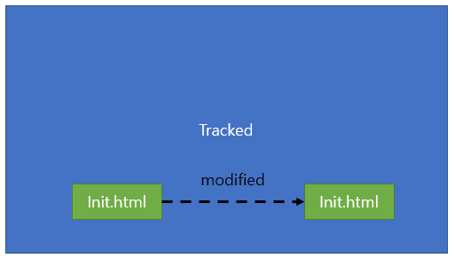

### deleted status

`git`에서 관리 하는 파일의 `deleted` 상태는 두가지로 확인할 수 있습니다.

첫번째는 `tracked`된 파일을 `untracked`상태로 변경하는 것

두번째는 파일 시스템의 파일을 제거하여 `tracked`된 파일을 `deleted`상태로 변경하는 것 입니다.

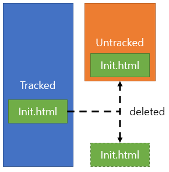

실습을 위하여 `deleted.html`파일을 하나 추가하여 내용을 등록 하겠습니다.

```html
<h1>git delete status</h1>
```

`git status`를 사용하여 `git`의 상태를 확인해 봅니다.

```sh
admin@jinhyeok MINGW64 ~/dev/00010/100 (master)
$ git status
On branch master

No commits yet

Changes to be committed:
  (use "git rm --cached <file>..." to unstage)
        new file:   init.html

Changes not staged for commit:
  (use "git add <file>..." to update what will be committed)
  (use "git restore <file>..." to discard changes in working directory)
        modified:   init.html

Untracked files:
  (use "git add <file>..." to include in what will be committed)
        deleted.html
```

`deleted.html`이 `untracked`상태로 변경 된 것을 확인할 수 있습니다.

`deleted.html`을 `git add` 명령어를 통하여 `stage`상태로 변경한 다음 `git status`로 `git`의 파일 관리 상태를 확인해 봅니다.

```sh
$ git status
On branch master

No commits yet

Changes to be committed:
  (use "git rm --cached <file>..." to unstage)
        new file:   deleted.html
        new file:   init.html

Changes not staged for commit:
  (use "git add <file>..." to update what will be committed)
  (use "git restore <file>..." to discard changes in working directory)
        modified:   init.html
```

`untracked`상태의 파일을 `tracked`으로 변경 되어 `deleted.html`파일은 `git`에서 관리되고 있습니다.

이 파일을 `git rm`명령문을 통하여 `git`의 관리에서 제거한 다음 `git status`명령문을 통하여 상태를 확인해 보겠습니다.

( `--cached`옵션은 관리에서 제외 하겠다는 것으로 `tracked`상태에서 `untracked`상태로 변경한다는 말과 동일합니다. )

> git rm --cached

```sh
admin@jinhyeok MINGW64 ~/dev/00010/100 (master)
$ git rm --cached deleted.html
rm 'deleted.html'

admin@jinhyeok MINGW64 ~/dev/00010/100 (master)
$ git status
On branch master

No commits yet

Changes to be committed:
  (use "git rm --cached <file>..." to unstage)
        new file:   init.html

Changes not staged for commit:
  (use "git add <file>..." to update what will be committed)
  (use "git restore <file>..." to discard changes in working directory)
        modified:   init.html

Untracked files:
  (use "git add <file>..." to include in what will be committed)
        deleted.html
```

현재 우리가 작업한 내용은 아래 그림과 동일합니다.


`git`의 관리 상태 여부를 변경하였습니다.

하지만 `deleted`상태에 관하여 여기까지 하고 상태 변경과 관련 된 자세한 내용은 뒤편 `commit`이후에 다루어 보도록 하겠습니다.

### git commit

`git`은 `git`에서 관리하는 파일들을 `untracked`상태와 `tracked`상태로 구분하며

`tracked`상태의 파일들을 `modified`와 `deleted`상태로 구분하여 처리한다고 말하였습니다.

이 때 넘어간 부분이 있는데 `tracked`상태의 파일들은 모두 `stage area`또는 `repository`에 등록 된 파일이라는 것입니다.

자 이제 우리가 작업한 구조를 아래 그림을 보면서 알아보겠습니다.

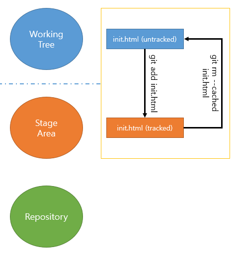

아직까지는 `git`의 궁극적인 목표인 소스의 변동(변경)사항 관리가 제대로 이루어지고 있지 않습니다.

소스의 변동사항을 관리하기 위해서는 일정 시간, 일정 기간 또는 일정 테마별로 소스의 변경 정보를 저장하여야 합니다.

현재까지의 작업물들은 모두 `working tree`와 `stage area`에서만 작업 되고 있었습니다.

이제 처음으로 `repository`영역에 변경사항을 기재해보도록 하겠습니다.

그전에 `stage area` 올라가지 않은 파일을 `git add` 명령어를 통하여 올려보도록 합니다.

```sh
admin@jinhyeok MINGW64 ~/dev/00010/100 (master)
$ git add init.html deleted.html

admin@jinhyeok MINGW64 ~/dev/00010/100 (master)
$ git status
On branch master

No commits yet

Changes to be committed:
  (use "git rm --cached <file>..." to unstage)
        new file:   deleted.html
        new file:   init.html
```

모두 `strage area` 에 잘 올라가 있다면 이제 처음으로 `git commit` 명령어를 작성해 보도록 하겠습니다.

( `-m`명령어는 `commit` 시 메시지를 등록하는 옵션입니다. )

> git commit -m

```sh
admin@jinhyeok MINGW64 ~/dev/00010/100 (master)
$ git commit -m "first commit"
[master (root-commit) d461c1a] first commit
 2 files changed, 3 insertions(+)
 create mode 100644 deleted.html
 create mode 100644 init.html
```

커밋이 모두 완료 되었다면 `git status` 명령어를 통하여 깃의 파일 관리 상태를 확인합니다.

```sh
$ git status
On branch master
nothing to commit, working tree clean
```

- - -
key. `--amend`

`commit`을 너무 빨리 하였거나 메시지를 다시 입력하고 싶을 경우

`commit`명령문 뒤에 `--amend` 옵션을 추가하면 `vi`편집기가 열리면서 원하는 메시지를 입력할 수 있도록 되어 있다.

> git commit --amend

```sh
admin@jinhyeok MINGW64 ~/dev/00010/100 (master)
$ git commit --amend
```

- - -

`working tree clean`이라는 메시지가 출력 되고 아무런 파일도 올라가 있지 않다는 것을 확인할 수 있습니다.

이번에는 `git log` 명령어를 통하여 `git`에서 관리 되고 있는 소스 변동 정보를 확인해 보겠습니다.

```sh
admin@jinhyeok MINGW64 ~/dev/00010/100 (master)
$ git log
commit d461c1a5fbbf80946b085d00efc438b95aed3ffd HEAD (HEAD -> master)
Author: kim0lil <kim0lil@naver.com>
Date:   Thu Jun 30 10:56:27 2022 +0900

    first commit
```

위의 상태는 아래 그림과 같습니다.

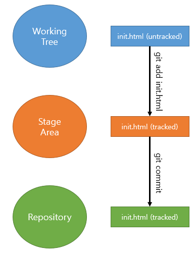

- - -

key. git file(s) status

`git`에서 관리 되는 파일의 상태는 `untracked`와 `tracked`가 있으며 `tracked`되는 파일들은 `3가지`상태를 추가적으로 가지게 됩니다.

1. modified : `tracked` 되어 있는 파일의 변경 사항을 확인하여 파일이 변경되어 있는 상태
2. staged : `modified` 또는 `untracked` 상태의 파일을 `commit`전 임시로 저장하는 상태
3. committed : `staged` 되어 있는 파일을 임의의 해시값을 가진 그룹으로 묶어 저장하는 상태


- - -

#### deleted and updated status

이전장에서 `deleted`상태를 다룰 때 `tracked`상태에 대한 변경만 처리하였다고 하였습니다.

하지만 지금처럼 `repository`에 올라간 상태에서의 상태 변경은 어떻게 일어 나는지 확인해 보도록 하겠습니다.

이전처럼 `git rm`명령어를 통하여 `deleted.html`파일을 변경하게되면 이전과는 다르게 `deleted.html`파일은 `repository`의 파일과 비교하기 때문에 파일의 변경 상태가 `deleted`라고 나타나고 파일의 관리 상태가 `tracked`상태에서 `untracked`상태로 변경 되었습니다.

```sh
admin@jinhyeok MINGW64 ~/dev/00010/100 (master)
$ git rm --cached deleted.html
rm 'deleted.html'

admin@jinhyeok MINGW64 ~/dev/00010/100 (master)
$ git status
On branch master
Changes to be committed:
  (use "git restore --staged <file>..." to unstage)
        deleted:    deleted.html

Untracked files:
  (use "git add <file>..." to include in what will be committed)
        deleted.html
```

이처럼 `git`에서 관리되고 있는 파일을 관리하지 않도록 상태를 변경할 수 있습니다.


그렇다면 이제 실제 파일 시스템에서 파일을 삭제하기 위하여 `git add`명령문을 통하여 `deleted.html`파일을 다시 `tracked`상태로 변경합니다.

```sh
admin@jinhyeok MINGW64 ~/dev/00010/100 (master)
$ git add deleted.html
```

다음으로 파일 시스템에서 실제 파일을 제거하여 `git`에서 관리되고 있는 파일의 상태를 변경하도록 하겠습니다.

명령어는 동일하게 `git rm`이며 추가적인 옵션으로 `--cached`가 아닌 `--force` 명령어를 통하여 실제 파일을 제거 할수 있습니다.

제거한 다음 `git status`명령문을 사용하여 파일 관리 상태를 확인합니다.

```sh
admin@jinhyeok MINGW64 ~/dev/00010/100 (master)
$ git rm --force deleted.html
rm 'deleted.html'

admin@jinhyeok MINGW64 ~/dev/00010/100 (master)
$ git status
On branch master
Changes to be committed:
  (use "git restore --staged <file>..." to unstage)
        deleted:    deleted.html
```

명령문을 실행하면 실제 파일에서 제거되고 파일 상태 정보가 강제로 `stage area` 영역에 올라온 것을 확인할 수 있습니다.

이대로 다음 `git commit`을 진행한 다음 `git log`명령문을 통하여 변동 상태를 확인해 보도록 하겠습니다.

```sh
admin@jinhyeok MINGW64 ~/dev/00010/100 (master)
$ git commit -m "delete.html file delete"
[master 723111e] delete.html file delete
 1 file changed, 1 deletion(-)
 delete mode 100644 deleted.html

admin@jinhyeok MINGW64 ~/dev/00010/100 (master)
$ git log
commit 723111e311314618d35d0fdc4919d2c7e96149da (HEAD -> master)
Author: kim0lil <kim0lil@naver.com>
Date:   Thu Jun 30 11:27:00 2022 +0900

    delete.html file delete

commit d461c1a5fbbf80946b085d00efc438b95aed3ffd
Author: kim0lil <kim0lil@naver.com>
Date:   Thu Jun 30 10:56:27 2022 +0900

    first commit

```

소스 반영이 무사히 적용 된 것을 확인할 수 있습니다.

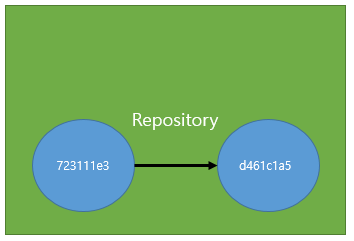

이번에는 수정(`updated`) 상태를 반영해 보도록 하겠습니다.

기존 `init.html`파일을 아래와 같이 수정한 다음 `git status`명령문을 사용하여 관리 상태를 확인해 보겠습니다.

```html
<h1>git init</h1>
<h2>update tracking file</h2>
<h3>updated state tracking</h3>
```

파일을 수정하여 저장한 다음 상태를 확인해 봅니다.

```sh
$ git status
On branch master
Changes not staged for commit:
  (use "git add <file>..." to update what will be committed)
  (use "git restore <file>..." to discard changes in working directory)
        modified:   init.html

no changes added to commit (use "git add" and/or "git commit -a")
```

`init.html` 파일이 수정 상태를 변경 되었습니다.

다음 실습을 위하여 `init.html`파일을 `stage area`영역으로 이동시켜 놓도록 합니다.

```sh
admin@jinhyeok MINGW64 ~/dev/00010/100 (master)
$ git add init.html

admin@jinhyeok MINGW64 ~/dev/00010/100 (master)
$ git status
On branch master
Changes to be committed:
  (use "git restore --staged <file>..." to unstage)
        modified:   init.html
```

#### git restore

프로젝트를 하는 동안 다양한 일이 발생합니다.

그중 가장 흔하게 일어나는 일은 작업중인 영역(`working tree`)에서 파일을 삭제 하였거나 수정해서는 안되는 파일을 수정하였을 때 입니다.

이러한 문제점을 해결하기 위해서는 `git restore`명령문에 대해서 알아야 할 필요성이 있습니다.

`git restore`는 파일의 상태(`working tree(untracked)`,`strage(tracked)`)를 이전으로 변경하는 명령문입니다.

이전에 `strage area`에 올라간 `init.html`파일을 `working tree`영역으로을 복구 하도록 하겠습니다.

> git restore --staged

```sh
admin@jinhyeok MINGW64 ~/dev/00010/100 (master)
$ git restore --staged init.html

admin@jinhyeok MINGW64 ~/dev/00010/100 (master)
$ git status
On branch master
Changes not staged for commit:
  (use "git add <file>..." to update what will be committed)
  (use "git restore <file>..." to discard changes in working directory)
        modified:   init.html
```

`strage area`에서 `working area`영역으로 복원 되었습니다.

이제는 조금 더 나아가서 `working area`영역에서 `modified` 상태에서 `unmodified` 상태로 변경해 보도록 하겠습니다.

> git restore

```sh
admin@jinhyeok MINGW64 ~/dev/00010/100 (master)
$ git restore init.html

admin@jinhyeok MINGW64 ~/dev/00010/100 (master)
$ git status
On branch master

No commits yet
```

#### git reset

이번에는 조금 다양한 방법으로 소스코드를 제어 하는 방법을 알아 보겠습니다.

그 전에 실습을 위하여 `init.html` 파일을 수정하여 커밋을 추가하도록 하겠습니다.

```html
<h1>git init</h1>
<h2>update tracking file</h2>
<ul>
    <li>item1</li>
</ul>
```

다음으로 `modified`상태의 파일을 `stage`에 등록한 다음 `commit`상태로 변경하겠습니다.

( `-am` 옵션은 `tracked` 상태의 파일을 모두 스테이지에 올린 다음 `commit`을 수행하는 옵션입니다.)

> git commit -am

```sh
admin@jinhyeok MINGW64 ~/dev/00010/100 (master)
$ git commit -am 'add item 1'
[master 1295c14] add item 1
 1 file changed, 4 insertions(+), 1 deletion(-)
```

다음으로 아이템을 하나 더 추가한 다음 `commit`을 추가하겠습니다.

```html
<h1>git init</h1>
<h2>update tracking file</h2>
<ul>
    <li>item1</li>
    <li>item2</li>
</ul>
```

동일하게 `commit`을 추가하겠습니다.

```sh
admin@jinhyeok MINGW64 ~/dev/00010/100 (master)
$ git commit -am 'add item 2'
[master 0100828] add item 2
 1 file changed, 1 insertion(+)
```

`git log` 명령문을 통하여 커밋 정보를 확인하겠습니다.

( `--oneline` 옵션은 커밋의 `shot`해시값과 로그를 한줄로 요약해서 보여주는 옵션 입니다. )

> git log --oneline
> git log

```sh
admin@jinhyeok MINGW64 ~/dev/00010/100 (master)
$ git log --oneline
0100828 (HEAD -> master) add item 2
1295c14 add item 1
723111e delete.html file delete
d461c1a first commit
```

이제 커밋 트리는 아래 구조를 지니게 될 것입니다.


이제부터 하나씩 `reset`을 하면서 각 옵션들에 관하여 다루어 보겠습니다.

`reset`명령문은 크게 3가지 옵션을 가지고 있습니다.

1. soft : `staged` 상태까지 소스를 돌려 놓는다.
2. mixed : `updated` 상태까지 소스를 돌려 놓는다.
3. hard : `committed` 상태까지 소스를 돌려 놓는다.

가장 먼저 `soft`옵션을 사용하여 이전(**1295c14**) `commit`으로 리셋 한 다음 상태를 확인해 보도록 하겠습니다.

> git reset --soft

```sh
admin@jinhyeok MINGW64 ~/dev/00010/100 (master)
$ git reset --soft 1295c14

admin@jinhyeok MINGW64 ~/dev/00010/100 (master)
$ git status
On branch master
Changes to be committed:
  (use "git restore --staged <file>..." to unstage)
        modified:   init.html
```

현재 `init.html`은 커밋 전 `staged`상태로 돌아가 있습니다.

`init.html` 파일도 확인해 보겠습니다.

```html
<h1>git init</h1>
<h2>update tracking file</h2>
<ul>
    <li>item1</li>
    <li>item2</li>
</ul>
```

역시 `init.html` 파일은 `item2` 로 수정되어 있습니다.

그렇다면 다시 `commit`을 실행한 다음 `mixed`옵션을 사용하여 `reset` 명령문을 실행해 보겠습니다.

```sh
admin@jinhyeok MINGW64 ~/dev/00010/100 (master)
$ git commit -am 'add item 2'
[master abd675f] add item 2
 1 file changed, 1 insertion(+)

$ git reset --mixed HEAD^
Unstaged changes after reset:
M       init.html
```

정상적으로 `reset`되었습니다.

- - -
key. HEAD

`git commit`이 정상적으로 되었을 경우 `git log`를 확인해 보면 `HEAD`라는 문구가 보일 것입니다.

```sh
admin@jinhyeok MINGW64 ~/dev/00010/100 (master)
$ git log --oneline
1295c14 (HEAD -> master) add item 1
723111e delete.html file delete
d461c1a first commit
```

이 `HEAD`는 항상 `commit`의 마지막을 가르키는 이정표 같은 존재입니다.

이 `HEAD`를 사용하여 이전 `HEAD` 또는 원하는 `commit` 까지의 범위를 찾을 수 있습니다.

이전 `HEAD`를 찾으려면 `^`기호를 사용하며 `^^`와 같이 중첩하여 사용할 수 있습니다.

- - -

이제 `git`의 상태를 확인해 보겠습니다.

```sh
$ git status
On branch master
Changes not staged for commit:
  (use "git add <file>..." to update what will be committed)
  (use "git restore <file>..." to discard changes in working directory)
        modified:   init.html
```

이전과는 다르게 `modified`상태로 돌아갔습니다.

파일의 정보는 그대로인지 확인해 보겠습니다.

```html
<h1>git init</h1>
<h2>update tracking file</h2>
<ul>
    <li>item1</li>
    <li>item2</li>
</ul>
```

역시나 그대로이네요.

`reset`명령문 중 `--soft`와 `--mixed`의 차이는 이와 같이 이전 `commit`으로 돌아 갈 때 `stage`상태를 유지 여부가 다르다는 것을 알 수 있습니다.

이번에는 조금 조심히 다루어야 할 `--hard`에 관하여 처리해 보겠습니다.

`commit`을 추가한 다음 `--hard` 옵션을 사용하여 `reset`을 실행해 보겠습니다.

```sh
admin@jinhyeok MINGW64 ~/dev/00010/100 (master)
$ git commit -am 'add item 2'
[master dda53c7] add item 2
 1 file changed, 1 insertion(+)

admin@jinhyeok MINGW64 ~/dev/00010/100 (master)
$ git reset --hard HEAD^
HEAD is now at 1295c14 add item 1
```

이전과 동일하게 먼저 `status`를 확인해 봅니다.

```sh
admin@jinhyeok MINGW64 ~/dev/00010/100 (master)
$ git status
On branch master
```

아무런 수정 사항이 없습니다.

그렇다면 파일의 수정 여부를 확인해 봅니다.

```html
<h1>git init</h1>
<h2>update tracking file</h2>
<ul>
    <li>item1</li>
</ul>
```

파일이 이전 `commit` 상태로 돌아갔습니다.

이와 같이 `--hard`옵션은 기존의 파일을 커밋 초기 상태로 변경하는 가장 강력한 `reset` 옵션이라고 할 수 있습니다.

#### git checkout

파일을 이전으로 돌리기 위해서 사용하는 기능으로는 `reset`과 비슷한 기능인 `checkout`을 사용할 수 있습니다.

`checkout`은 `reset`에 `--hard`옵션을 추가한 기능이라고 볼 수 있습니다.

또한 단순히 해당 버전의 소스를 덮어 쒸우는 용도로 사용하기도 합니다.

실습을 위하여 `init.html`파일 수정합니다.

```html
<h1>git init</h1>
<h2>update tracking file</h2>
<ul>
    <li>item1</li>
    <li>item2</li>
</ul>
```

`checkout`명령문을 사용하여 파일을 이전으로 돌려보겠습니다.

```sh
admin@jinhyeok MINGW64 ~/dev/00010/100 (master)
$ git checkout
```

`init.html`파일을 확인해 보면 이전으로 돌아 간 것을 알수 있습니다.

```html
<h1>git init</h1>
<h2>update tracking file</h2>
<ul>
    <li>item1</li>
    <li>item2</li>
</ul>
```

하지만 `checkout`의 경우는 `working tree`에도 기록하지 않는 정보가 날라가므로 `reset --hard`와 마찬가지로 조심히 사용해야 할 것입니다.

### .gitignore

이번에는 조금 다른 이야기를 해볼까 합니다.

모든 파일을 `tracked`상태로 올려야 할 필요는 없습니다.

가령 `.bash` 파일과 같이 일부 파일은 관리되지 않아야 하는 파일이거나 또는 빌드중에 생성되는 임시 파일일 수 있습니다.

따라서 이러한 파일은 상태를 비교하는 것 또한 불필요한 작업이기 때문입니다.

이런 관리되지 않아야 하는 파일을 관리하는 파일이 바로 `.gitignore`파일입니다.

`.git`폴더가 있는 곳(`git init`을 진행한 곳)에서 `.gitignore`파일을 생성한 다음 아래 값을 등록합니다.

```vi
.untracked-files
```

그런 다음 `.untracked-files` 폴더를 생성하여 그 안에 `temp.html`파일을 생성하여 아래 값을 등록합니다.

```html
<h1>it want file untraking<h1>
```

전체적인 파일 구조를 보면 아래와 같습니다.

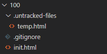

`git status`명령어를 통하여 `git`에서 관리 되고 있는 상태를 확인해 보겠습니다.

```sh
$ git status
On branch master
Untracked files:
  (use "git add <file>..." to include in what will be committed)
        .gitignore

nothing added to commit but untracked files present (use "git add" to track)
```

`.untracked-files`폴더는 `git`에서 관리되지 않는 폴더로 적용 되고 있습니다.

이 처럼 관리가 불 필요한 파일/폴더의 경우 `.gitignore`파일을 사용하여 처리할 수 있습니다.

그 외에도 `ant`표기식을 사용한 표현식은 적용 가능하니 자세한 문법은 `ant-expression`공식 문서(**<https://ant.apache.org/manual/dirtasks.html>**)를 확인하도록 합니다.

마지막으로 `.gitignire`파일을 `add`명령문을 통하여 `tracked`상태로 변경한 다음 `commit`명령문으로 반영하도록 하자.

(`git commit`을 실행할 경우 `vi`편집기가 열리면서 메시지를 입력하라고 한다.)

> git commit

```sh
admin@jinhyeok MINGW64 ~/dev/00010/100 (master)
$ git add .gitignore

admin@jinhyeok MINGW64 ~/dev/00010/100 (master)
$ git commit
# Please enter the commit message for your changes. Lines starting
# with '#' will be ignored, and an empty message aborts the commit.
#
# On branch master
# Changes to be committed:
#       new file:   .gitignore
add git ignore file

[master 9dc1eb4] add git ignore file
 1 file changed, 1 insertion(+)
 create mode 100644 .gitignore
```

## git remote

이번에는 원격 저장소에 관하여 간략하게 설명해보도록 하겠습니다.

이전까지는 로컬 저장소를 기반으로 작업하였습니다.

하지만 이번장에는 로컬 저장소와 원격 저장소를 번갈아가면서 사용할 것이므로 원격 저장소가 없는 사람은 깃허브(**<https://github.com>**)로 이동하여 회원가입을 해 주시거나

`git lab`을 실행하여 원격 저장소를 사용해 주셔야 합니다.

이곳에는 `gitgub`를 기반으로 설명하도록 하겠습니다.

( 깃 허브 저장소는 `https://github.com/kim0lil`을 사용하도록 하겠습니다. )

먼저 깃 허브에서 저장소를 하나 생성합니다.


`new Repository`버튼을 클릭한 다음 저장소 정보를 입력하고 `Create repository`를 선택합니다.

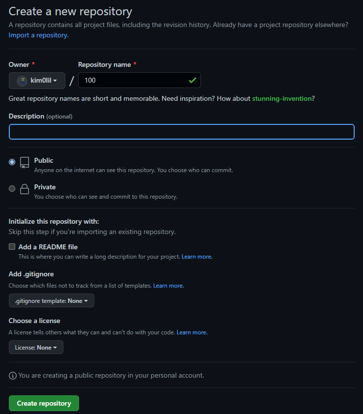

### git remote add

저장소가 생성 되었으면 저장소의 주소값을 확인할 수 있습니다.

( `git hub`는 `http`또는 `ssh`접근을 제공하고 있습니다. )

`https` 버튼을 선택한 다음 접근 주소를 복사해둡니다.


`git remote add` 명령문을 사용하여 원격 저장소 주소를 현재 디렉토리로 연결하겠습니다.

( `git remote add` 명령문은 `git remote add [단축명칭] [url]`을 입력합니다. )

> git remote add

```sh
admin@jinhyeok MINGW64 ~/dev/00010/100 (master)
$ git remote add origin https://github.com/kim0lil/100.git
```

원격 저장소가 잘 적용 되었는지 확인해 보도록 하겠습니다.

원격 저장소를 확인하기 위해서는 `git remote`명령문으로 통하여 조회 가능합니다.

```sh
admin@jinhyeok MINGW64 ~/dev/00010/100 (master)
$ git remote
origin
```

너무 간단한 내용만이 출력 되고 있습니다.

따라서 더 자세한 내용(`URL`등)을 조회하고 싶을 경우 `--verb`옵션을 추가하여 조회합니다.

> git remote --verb
> git remote -v

```sh
$ git remote --verb
origin  https://github.com/kim0lil/100.git (fetch)
origin  https://github.com/kim0lil/100.git (push)
```

### git push

원격 저장소가 연결이 되었다면 소스의 안전성을 위하여 원격 저장소에 나의 소스를 적용시켜 보도록 하겠습니다.

원격지에 나의 소스를 적용시키기 위해서는 `git push` 명령문을 사용하여 적용시킵니다.

( `--set-upstream`옵션은 원격지의 `(push)` 명칭을 등록합니다. )

> git push --set-upstream
> git push -u
> git push

```sh
admin@jinhyeok MINGW64 ~/dev/00010/100 (master)
$ git push --set-upstream origin master
Enumerating objects: 12, done.
Counting objects: 100% (12/12), done.
Delta compression using up to 12 threads
Compressing objects: 100% (7/7), done.
Writing objects: 100% (12/12), 1.02 KiB | 1.02 MiB/s, done.
Total 12 (delta 0), reused 0 (delta 0), pack-reused 0
To https://github.com/kim0lil/100.git
 * [new branch]      master -> master
branch 'master' set up to track 'origin/master'.
```

정상적으로 반영된 것을 확인하기 위하여 `github`로 이동하여 확인해 보도록 합니다.

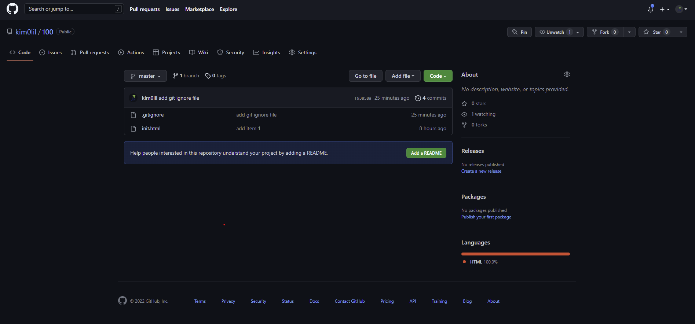

### git clone

이번에는 우리가 올린 소스를 가져와 보도록 하겠습니다.

새로운 디렉토리를 생성하여 이동한 다음 `git clone`명령문을 통하여 소스를 가져옵니다.

( `git clone`은 원격지의 정보를 원하는 디렉토리로 복사해오는 기능입니다. 예제에서는 가장 위에 `.`(현재 디렉토리)이 붙어 있다는것을 유념하도록 합니다. )

> git clone

```sh
admin@jinhyeok MINGW64 ~/dev/00010/100 (master)
$ cd ..

admin@jinhyeok MINGW64 ~/dev/00010 (master)
$ mkdir 101

admin@jinhyeok MINGW64 ~/dev/00010 (master)
$ cd 101

admin@jinhyeok MINGW64 ~/dev/00010/101 (master)
$ git clone https://github.com/kim0lil/100.git .
Cloning into '.'...
remote: Enumerating objects: 12, done.
remote: Counting objects: 100% (12/12), done.
remote: Compressing objects: 100% (7/7), done.
remote: Total 12 (delta 0), reused 12 (delta 0), pack-reused 0
Receiving objects: 100% (12/12), done.
```

이제 `100`과 `101`을 번갈아 가면서 사용하겠습니다.

`101`에서 파일을 하나 수정한 다음 원격지에 반영해보겠습니다.

`remote.html`파일을 하나 생성한 다음 값을 등록합니다.

```html
<h1>git remote</h1>
```

`remote.html`파일은 신규 생성한 파일이므로 `untracked` 상태 입니다.

다시 한번 `git status`명령문을 통하여 확인해 봅니다.

```sh
$ git status
On branch master
Your branch is up to date with 'origin/master'.

Untracked files:
  (use "git add <file>..." to include in what will be committed)
        remote.html
```

`git add` 명령문을 통하여 `remote.html`파일을 `tracked`상태로 변경한 다음 `staged`상태로 변경 하겠습니다.

```sh
admin@jinhyeok MINGW64 ~/dev/00010/101 (master)
$ git status
On branch master
Your branch is up to date with 'origin/master'.

Changes to be committed:
  (use "git restore --staged <file>..." to unstage)
        new file:   remote.html
```

`staged`상태까지 적용 되었다면 이제 `commit`명령문을 통하여 `committed`상태로 변경합니다.

```sh
$ git commit -m 'remote updated'
[master 131c48c] remote updated
 1 file changed, 1 insertion(+)
 create mode 100644 remote.html
```

`commit`까지 완료 하였다면 이제 원격지로 반영하는 일만 남았습니다.

`git clone`을 통하여 소스를 내려받았기 때문에 기본적으로 원격지 정보는 저장되어 있을 것입니다.

`git remote`명령문을 통하여 확인해보도록 합니다.

```sh
$ git remote -v
origin  https://github.com/kim0lil/100.git (fetch)
origin  https://github.com/kim0lil/100.git (push)
```

위와 같이 되어 있다면 `push`명령문을 통하여 신규 파일을 원격지에 반영 합니다.

```sh
$ git push
Enumerating objects: 4, done.
Counting objects: 100% (4/4), done.
Delta compression using up to 12 threads
Compressing objects: 100% (2/2), done.
Writing objects: 100% (3/3), 320 bytes | 320.00 KiB/s, done.
Total 3 (delta 0), reused 0 (delta 0), pack-reused 0
To https://github.com/kim0lil/100.git
   f93858a..131c48c  master -> master
```

실제 원격지에 반영이 되었는지 확인해 보겠습니다.

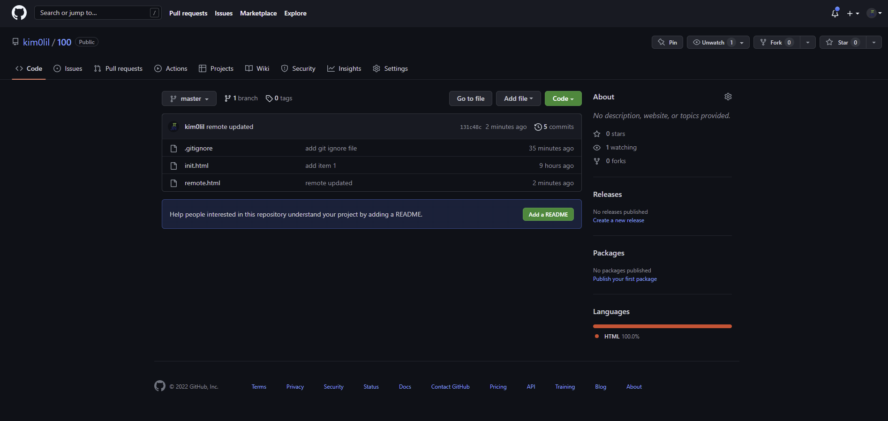

### git pull

이제는 `100`으로 돌아가서 `101`에서 작성한 코드를 업데이트 받아 보도록 하겠습니다.

소스를 업데이트 받기 위해서는 `git pull`명령문을 통하여 원격지에서 업데이트 받을 수 있습니다.

> git pull

```sh
admin@jinhyeok MINGW64 ~/dev/00010/101 (master)
$ cd ..

admin@jinhyeok MINGW64 ~/dev/00010 (master)
$ cd 100

$ git pull
remote: Enumerating objects: 4, done.
remote: Counting objects: 100% (4/4), done.
remote: Compressing objects: 100% (2/2), done.
remote: Total 3 (delta 0), reused 3 (delta 0), pack-reused 0
Unpacking objects: 100% (3/3), 300 bytes | 37.00 KiB/s, done.
From https://github.com/kim0lil/100
   f93858a..131c48c  master     -> origin/master
Updating f93858a..131c48c
Fast-forward
 remote.html | 1 +
 1 file changed, 1 insertion(+)
 create mode 100644 remote.html
```

올바르게 다운로드가 되었다면 이제 `101`로 이동하여 `remote`정보를 수정하는 실습을 이어 가겠습니다.

```sh
admin@jinhyeok MINGW64 ~/dev/00010/100 (master)
$ cd ..

admin@jinhyeok MINGW64 ~/dev/00010 (master)
$ cd 101
```

### git remote rename

이번에는 이전에 등록한 `remote`정보를 수정해 보겠습니다.

먼저 명칭을 수정할 경우 `git remote rename`명령문을 통하여 수정할 수 있습니다.

`origin`명칭을 `main`으로 수정한 뒤 원격 정보를 확인합니다.

```sh
admin@jinhyeok MINGW64 ~/dev/00010/101 (master)
$ git remote rename origin main
Renaming remote references: 100% (3/3), done.

admin@jinhyeok MINGW64 ~/dev/00010/101 (master)
$ git remote -v
main    https://github.com/kim0lil/100.git (fetch)
main    https://github.com/kim0lil/100.git (push)
```

`remote.html`파일을 수정하겠습니다.

```html
<h1>git remote</h1>
<h2>updated remote information</h2>
```

`modified`상태의 파일을 `commit`상태로 변경한 다음 원격지에 반영합니다.

( `-u`으로 명시적으로 `--set-upstream`을 등록 하였지만 한번 `push` 한 뒤부터는 자동으로 연결되어 있으므로 `git push` 명령문만으로도 업로드 됩니다. )

```sh
admin@jinhyeok MINGW64 ~/dev/00010/101 (master)
$ git commit -am 'updated remote info'
[master 1e68ac2] updated remote info
 1 file changed, 2 insertions(+), 1 deletion(-)

admin@jinhyeok MINGW64 ~/dev/00010/101 (master)
$ git push -u main
Enumerating objects: 2, done.
Counting objects: 100% (2/2), done.
Delta compression using up to 12 threads
Compressing objects: 100% (2/2), done.
Writing objects: 100% (2/2), 397 bytes | 397.00 KiB/s, done.
Total 2 (delta 0), reused 0 (delta 0), pack-reused 0
To https://github.com/kim0lil/100.git
   1e68ac2..9220408  master -> master
branch 'master' set up to track 'main/master'.
```

### git remote remove

원격지 정보를 모두 사용하였다면 `remote`정보를 삭제해보도록 하겠습니다.

원격지 정보를 삭제 하기 위해서는 `git remote remove`명령문을 통하여 삭제합니다.

삭제한 다음 `git remote -v`명령문을 통하여 잘 지워졌는지 확인하도록 합니다.

```sh
admin@jinhyeok MINGW64 ~/dev/00010/101 (master)
$ git remote remove main

admin@jinhyeok MINGW64 ~/dev/00010/101 (master)
$ git remote -v
```

이제부터는 다시 `100`으로 돌아와서 `101`에서 올린 소스를 업데이트 받은 다음 실습을 진행하도록 하겠습니다.

```sh
admin@jinhyeok MINGW64 ~/dev/00010/101 (master)
$ cd ..

admin@jinhyeok MINGW64 ~/dev/00010 (master)
$ cd 100

admin@jinhyeok MINGW64 ~/dev/00010/100 (master)
$ git pull
remote: Enumerating objects: 7, done.
remote: Counting objects: 100% (7/7), done.
remote: Compressing objects: 100% (4/4), done.
remote: Total 5 (delta 2), reused 4 (delta 1), pack-reused 0
Unpacking objects: 100% (5/5), 515 bytes | 30.00 KiB/s, done.
From https://github.com/kim0lil/100
   131c48c..9220408  master     -> origin/master
Updating 131c48c..9220408
Fast-forward
 remote.html | 3 ++-
 1 file changed, 2 insertions(+), 1 deletion(-)
```

## git tag

비행기를 탈 떄 케리어에 태그를 단다고 합니다.

이러한 태그는 자신의 캐리어에 고유한 인식표를 부여하는 행위와 같습니다.

`git`에서는 이러한 고유한 인식표를 버전이라는 통합 관리 인식표를 부여함으로써 관리하고 있습니다.

보통 버전은 `1.0.0`과 같이 `major.miner.patch`를 점으로 구분하는 `Semantic versioning`이 대표적이라고 할 수있습니다.

이러한 버전 표기법은 뒤쪽에 `1.0.0-Beta`와 같이 `pre-`상태 기호룰 붙여 관리되기도 하는데 이러한 대표적인 예가 `spring`의 `1.0.0-RELEASE`와 같이 상태 기호를 주도적으로 사용합니다.

`git`에서는 이러한 태깅을 `annotated`와 `lightweight`로 나누어 등록하고 있습니다.

`annotated`는 체크썸 태그와 태그 정보(메시지)를 등록하며 `lightweight`는 체크썸 태그만을 등록한다는 차이점이 있습니다.

먼저 `annotated` 태그를 등록해 보겠습니다.

### annotated

현재까지 우리가 작업한 로그를 보면 아래와 같습니다.

```sh
admin@jinhyeok MINGW64 ~/dev/00010/101 (master)
$ git log --oneline
9220408 (HEAD -> master, origin/master) Merge branch 'master' of https://github.com/kim0lil/100
24dbe51 updated remote information
131c48c remote updated
f93858a add git ignore file
1295c14 add item 1
723111e delete.html file delete
d461c1a first commit
```

`first commit`에는 `1.0.0`을 기준으로 버전을 하나씩 추가해 보도록 하겠습니다.

`git tag`명령문을 통하여 등록 된 `tag`가 있는지 확인합니다.

```sh
admin@jinhyeok MINGW64 ~/dev/00010/100 (master)
$ git tag
```

`git tag`명령문을 사용하여 `first commit`에 태그를 등록합니다.

> git tag -a -m
> git tag -a

```sh
admin@jinhyeok MINGW64 ~/dev/00010/100 (master)
$ git tag -a '1.0.0' -m 'git tag first' d461c1a
```

`git sohw`명령문을 통하여 잘 등록 되어 있는지 확인합니다.

> git show --oneline
> git show

```sh
admin@jinhyeok MINGW64 ~/dev/00010/101 (master)
$ git show d461c1a --oneline
d461c1a (tag: 1.0.0) first commit
diff --git a/deleted.html b/deleted.html
```

### lightweight

`annotated`와 `lightweight`의 동일점은 체크썸 태그(`1.0.0`)을 남기는 것이며 차이점은 `lightweight`은 `annotated`와는 다르게 태그 정보(`git tag first`)정보를 남기지 않는다는 것입니다.

이점은 `annotated` 태그를 등록할 때 사용한 옵션은 `-a`에 있습니다.

이 옵션 `-a`는 `annotated`의 약어로 사용되며 `-a`옵션을 제외하고 순수한 체크썸 태그만을 남기기 위해서는 `-a`와 `-m`과 같은 옵션을 사용하지 않고 태그를 등록하면 됩니다.

`1.0.0`버전 다음인 `1.0.1`버전의 태그를 추가한 다음 `show`명령문을 통하여 확인하도록 하겠습니다.

```sh
admin@jinhyeok MINGW64 ~/dev/00010/100 (master)
$ git tag '1.0.1' 723111e

admin@jinhyeok MINGW64 ~/dev/00010/100 (master)
$ git show 1.0.1 --oneline
723111e (tag: 1.0.1) delete.html file delete
diff --git a/deleted.html b/deleted.html
```

태그는 여기까지 하고 브랜치를 배운 다음 더 다루어 보겠습니다.

## git branch

`git`에서 사용하는 `branch`라는 기능은 다른 소스 관리 툴과의 차별점은 제시합니다.

`git`의 버전관리 정보는 하나의 기본 점에서부터 `history`를 관리해 나가는 형식의 모양을 제시합니다.

`git`의 이런 차별점은 `branch`에서 극대화 됩니다.

예로 들면 `init.html`라는 파일의 `변동 정보(생성/수정/삭제)`를 하나의 `history`로 보고 각 변경점을 기재하여 파일의 전체적인 구조를 파악합니다.

### git pointer

여기에서 나아가서 `git`은 다양한 포인터를 제공하고 있습니다.

`history`를 `snapshot`이라는 형태의 포인터로 남겨 두는 것이 이전에 배운 `commit`이라는 명령문입니다.

실습을 위하여 새로운 폴더(`200`)를 생성한 다음 `git`을 초기화 하겠습니다.

```sh
admin@jinhyeok MINGW64 ~/dev/00010/100 (master)
$ cd ..

admin@jinhyeok MINGW64 ~/dev/00010 (master)
$ mkdir 200

admin@jinhyeok MINGW64 ~/dev/00010 (master)
$ cd 200

admin@jinhyeok MINGW64 ~/dev/00010/200 (master)
$ git init
Initialized empty Git repository in C:/Users/admin/dev/00010/200/.git/
```

`branch.html`파일을 생성한 다음 `add`명령문을 통하여 파일을 `untracked`상태에서 `staged(tracked)`상태로 변경하겠습니다.

```html
<h1>git branch</h1>
```

`git`의 포인터를 확인하는 방법은 `git log`명령문을 통하여 가능합니다.

`commit`전 포인터를 확인해보겠습니다.

```sh
admin@jinhyeok MINGW64 ~/dev/00010/200 (master)
$ git log
fatal: your current branch 'master' does not have any commits yet
```

`master` 브랜치에서 가리키는 포인터가 없다는 의미입니다.

`commit`을 통하여 `master`브랜치의 포인터를 생성해 보도록 하겠습니다.

```sh
admin@jinhyeok MINGW64 ~/dev/00010/200 (master)
$ git commit -m 'master branch commit'
[master (root-commit) 6a44003] master branch commit
 1 file changed, 1 insertion(+)
 create mode 100644 branch.html
```

다시 포인터를 확인해보겠습니다.

```sh
admin@jinhyeok MINGW64 ~/dev/00010/101 (master)
$ git log
commit 6a44003c3d2cd034fb03d366d95201ae11e59125 (HEAD -> master)
Author: kim0lil <kim0lil@naver.com>
Date:   Fri Jul 1 13:32:39 2022 +0900

    master branch commit
```

`HEAD`와 `master`의 포인터가 잡혀있는 것을 볼 수 있습니다.

( `HEAD`는 해당 브랜치의 최종 포인터를 나타내는 특수한 포인터 입니다. )

### git branch (hotfix)

이제 브랜치를 생성해보도록 하겠습니다.

( `git branch [브랜치명]`으로 `branch`를 생성할 수 있습니다. )

> git branch

```sh
admin@jinhyeok MINGW64 ~/dev/00010/200 (master)
$ git branch hotfix
```

생성된 `branch`를 확인하기 위해서는 `--list` 옵션을 사용합니다.

> git branch --list
> git branch -l

```sh
$ git branch --list
  hotfix
* master
```

더욱 자세한 항목을 보기 위해서는 `--verb`옵션을 추가합니다.

> git branch --verb
> git branch -v

```sh
admin@jinhyeok MINGW64 ~/dev/00010/200 (master)
$ git branch --verb
  hotfix 02493b0 master branch commit
* master 02493b0 master branch commit
```

`*`표시는 현재 작업중인 포인터를 나타내고 있습니다.

현재는 `master`와 `hotfix`가 동일한 포인터를 가르키고 있습니다.

`hotfix`로 이동하여 작업을 이어나가도록 하겠습니다.

현재 포인터를 이동하기 위해서는 이전에 배운 `git checkout`명령문을 사용합니다.

`checkout` 한 다음 `brach`의 상태를 확인해 봅니다.

```sh
admin@jinhyeok MINGW64 ~/dev/00010/200 (master)
$ git checkout hotfix
Switched to branch 'hotfix'

admin@jinhyeok MINGW64 ~/dev/00010/200 (hotfix)
$ git branch --verb
* hotfix 02493b0 master branch commit
  master 02493b0 master branch commit
```

- - -

key. `checkout -b`

브랜치를 생성한 다음 즉시 이동하고 싶을 경우 `checkout` 시 `-b`옵션을 사용하여 처리할 수 있다.

`master` 브랜치로 이동한 다음 `issue201` 브랜치를 생성하겠습니다.

> git checkout -b

```sh
admin@jinhyeok MINGW64 ~/dev/00010/200 (hotfix)
$ git checkout master
Switched to branch 'master'

admin@jinhyeok MINGW64 ~/dev/00010/200 (master)
$ git checkout -b issue201
Switched to a new branch 'issue201'
```

실습을 위하여 `hotfix`로 이동합니다.

```sh
admin@jinhyeok MINGW64 ~/dev/00010/200 (issue201)
$ git checkout hotfix
Switched to branch 'hotfix'
```

- - -

현재 상태를 그림으로 표현하자면 아래와 같습니다.

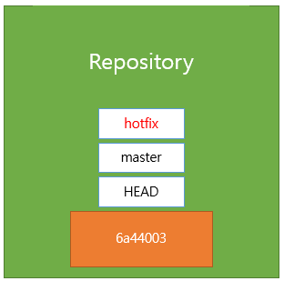

`hotfix` 브랜치에서 `hotfix.html`파일을 생성한 다음 아래 태그를 등록합니다.

```html
<h1>hotfix</h1>
```

`commit`명령문을 사용하여 포인터를 앞으로 이동시켜 보겠습니다.

```sh
admin@jinhyeok MINGW64 ~/dev/00010/200 (hotfix)
$ git commit -m 'hotfix commit'
[hotfix 184b516] hotfix commit
 1 file changed, 1 insertion(+)
 create mode 100644 hotfix.html
```

hotfix 포인터가 앞으로 이동하였습니다.

상태는 아래 그림과 같습니다.

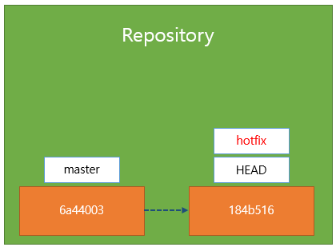

다음으로 `hotfix.html`를 아래와 같이 수정합니다.

```html
<h1>hotfix</h1>
<h2>release up</h2>
```

이미 `tracked`파일이기 때문에 `git commit -am`명령문을 사용하여 포인터를 반영합니다.

```sh
admin@jinhyeok MINGW64 ~/dev/00010/200 (hotfix)
$ git commit -am 'release base commit'
[hotfix 8fb9adc] release base commit
 1 file changed, 2 insertions(+), 1 deletion(-)
```

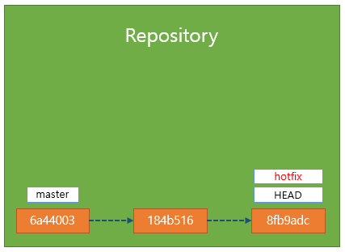

실습을 위하여 `master` 브랜치를 기준으로 새로운 브랜치를 생성하겠습니다.

먼저 `master` 브랜치로 이동한 다음 `dev200`브랜치를 생성하여 즉시 이동시키겠습니다.

```sh
admin@jinhyeok MINGW64 ~/dev/00010/200 (hotfix)
$ git checkout master
Switched to branch 'master'

admin@jinhyeok MINGW64 ~/dev/00010/200 (master)
$ git checkout -b dev200
Switched to a new branch 'dev200'
```


이제 `dev200` 브랜치에서 `dev.html`파일을 생성한 다음 아래 태그를 입력하고 저장합니다.

```html
<h1>development branch</h1>
```

새로운 포인터를 생성하겠습니다.

```sh
admin@jinhyeok MINGW64 ~/dev/00010/200 (dev200)
$ git add dev.html

admin@jinhyeok MINGW64 ~/dev/00010/200 (dev200)
$ git commit -m 'dev commit'
[dev200 de18d6d] dev commit
 1 file changed, 1 insertion(+)
 create mode 100644 dev.html
```

이제 우리의 포인터는 아래와 같은 그림으로 표현할 수 있습니다.

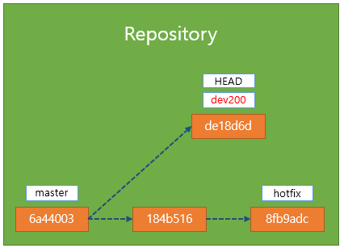

이렇게 세개의 브랜치(`master`, `dev200`, `hotfix`)가 분리 되게 되었습니다.

이 세개의 브랜치를 하나로 통합하도록 하겠습니다.

### git merge

다양한 브랜치를 생성 하다보면 실습처럼 소스가 분리되게 됩니다.

하지만 이러한 소스는 결국에는 하나로 통합 되어야 합니다.

이러한 소스를 통합하는 작업을 소스 병합(`merge`)라고 합니다.

소스 병합은 병합 알고리즘을 사용하여 병합 됩니다.

`git`에서 사용하는 기본 알고리즘은 크게 두가지로 분리 할 수 있습니다.

1. Fast-Forward : 공통 부모를 가진 브랜치가 같은 포인터를 가질 때 사용하는 병합
2. 3-way : 공통 부모를 가진 브랜치가 서로 다른 포인터를 가질 때 사용하는 병합

쉽게 설명하면 아래 그림과 같습니다.

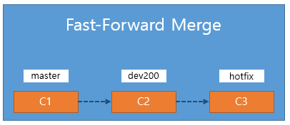

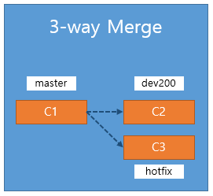

#### fast-forward merge

먼저 `master`와 `dev200`를 병합해 보도록 하겠습니다.

현재 우리의 `master` 브랜치는 가장 뒤쪽에 위치하고 있습니다.

`master`브랜치는 `dev200`브랜치의 공통된 위치에 있습니다.

따라서 `master`를 `dev200` 위치에 오도록 `fast-forward`로 병합할 수 있습니다.

`master`브랜치로 이동한 다음 `git merge` 명령문을 사용하여 두 브랜치를 병합하도록 하겠습니다.

> git merge

```sh
admin@jinhyeok MINGW64 ~/dev/00010/200 (dev200)
$ git checkout master
Switched to branch 'master'

admin@jinhyeok MINGW64 ~/dev/00010/200 (master)
$ git merge dev200
Updating 6a44003..de18d6d
Fast-forward
 dev.html | 1 +
 1 file changed, 1 insertion(+)
 create mode 100644 dev.html
```

병합 될 경우 `git`은 자동으로 `fast-forward` 병합을 사용하여 병합합니다.

현재 상태는 아래 그림과 같습니다.


이렇게 브랜치의 조상이 같은 위치선상에 있을 경우 `fast-forward` 병합을 사용하여 간단하게 병합이 가능합니다.

- - -

key. fast-forward

`fast-forward merge`는 변경이 동시에 일어나지 않는 개발에 유용합니다.

따라서 혼자서 개발하는 개발자가 편하게 사용 할 수 있는 병합 기능입니다.

- - -

#### 3-way merge

이번에는 `master`와 `hotfix`를 병합해 보도록 하겠습니다.

`master`와 `hotfix`는 서로 다른 위치에 있습니다.

따라서 이럴 경우 `3-way` 병합이 가능하며 병합 할 브랜치로 이동하여 병합을 진행합니다.

```sh
admin@jinhyeok MINGW64 ~/dev/00010/200 (master)
$ git merge hotfix

Merge branch 'hotfix'
# Please enter a commit message to explain why this merge is necessary,
# especially if it merges an updated upstream into a topic branch.
#
# Lines starting with '#' will be ignored, and an empty message aborts
# the commit.

Merge made by the 'ort' strategy.
 hotfix.html | 2 ++
 1 file changed, 2 insertions(+)
 create mode 100644 hotfix.html
```

병합이 완료 되었다면 `git log`명령문을 통하여 병합 로그를 확인합니다.

```sh
admin@jinhyeok MINGW64 ~/dev/00010/200 (master)
$ git log --oneline --graph --all
*   944a1aa (HEAD -> master) Merge branch 'hotfix'
|\
| * 8fb9adc (hotfix) release base commit
| * 184b516 hotfix commit
* | de18d6d (dev200) dev commit
|/
* 6a44003 (issue201) master branch commit
```

`master`브랜치가 올바르게 앞으로 이동하였다면 정상적으로 병합이 된 것입니다.

`git branch -d`명령문을 통하여 필요 없는 브랜치를 제거하겠습니다.

```sh
admin@jinhyeok MINGW64 ~/dev/00010/200 (master)
$ git branch -d dev200
Deleted branch dev200 (was de18d6d).

admin@jinhyeok MINGW64 ~/dev/00010/200 (master)
$ git branch -d hotfix
Deleted branch hotfix (was 8fb9adc).
```

### git conflict

이번에는 소스관리에서 가장 다루기 어려운 충돌(`conflict`)에 관하여 다루겠습니다.

충돌은 서로 다른 사람이 같은 소스를 작업할 때 발생합니다.

충돌이 발생할 경우 충돌을 해결해야만 병합이 가능하며 해결은 순수하게 병합하는 사람이 다뤄야 합니다.

실습을 위하여 새로운 폴더(`210`)를 생성한 다음 이동해 보도록 하겠습니다.

```sh
admin@jinhyeok MINGW64 ~/dev/00010/200 (master)
$ cd ..

admin@jinhyeok MINGW64 ~/dev/00010 (master)
$ mkdir 210

admin@jinhyeok MINGW64 ~/dev/00010 (master)
$ cd 210

admin@jinhyeok MINGW64 ~/dev/00010/210 (master)
$ git init
Initialized empty Git repository in C:/Users/admin/dev/00010/210/.git/
```

`init.html`파일을 생성한 다음 아래 태그를 입력합니다.

```html
<h1>conflict</h1>
<div>
    <span>first commit</span>
</div>
```

`commit`명령문을 사용하여 포인터를 생성합니다.

```sh
admin@jinhyeok MINGW64 ~/dev/00010/210 (master)
$ git add init.html

admin@jinhyeok MINGW64 ~/dev/00010/210 (master)
$ git commit -m 'confilict first commit'
[master (root-commit) 9ba6c56] confilict first commit
 1 file changed, 4 insertions(+)
 create mode 100644 init.html
```

충돌을 발생시키기 위하여 새로운 브랜치를 생성하겠습니다.

```sh
admin@jinhyeok MINGW64 ~/dev/00010/210 (master)
$ git checkout -b issue-1
Switched to a new branch 'issue-1'
```

`init.html`을 아래와 같이 수정합니다.

```html
<h1>conflict</h1>
<div>
    <span>first commit</span>
    <span>issue tracking</span>
</div>
```

`issue-1`브랜치에서 `commit`을 실행합니다.

```sh
admin@jinhyeok MINGW64 ~/dev/00010/210 (issue-1)
$ git commit -am 'issue-1 tracking'
[issue-1 cc75108] issue-1 tracking
 1 file changed, 1 insertion(+)
```

이제 충돌을 발생시켜보겠습니다.

`master` 브랜치로 이동 후 `issue-2`브랜치를 생성하여 이동합니다.

```sh
admin@jinhyeok MINGW64 ~/dev/00010/210 (issue-1)
$ git checkout master
Switched to branch 'master'

admin@jinhyeok MINGW64 ~/dev/00010/210 (master)
$ git checkout -b issue-2
Switched to a new branch 'issue-2'
```

`init.html`파일을 아래와 같이 수정합니다.

```html
<h1>conflict</h1>
<div>
    <span>first commit</span>
    <span>issue-2 tracking</span>
</div>
```

저장 하였다면 `commit`명령문을 사용하여 반영합니다.

```sh
admin@jinhyeok MINGW64 ~/dev/00010/210 (issue-2)
$ git commit -am 'issue-2 tracking'
[issue-2 e755fc6] issue-2 tracking
 1 file changed, 1 insertion(+)
```

현재 우리의 브랜치 `issue-1`과 `issue-2`는 같은 소스(`init.html`)을 수정하였습니다.

또한 같은 값을 수정하였기 때문에 이전 처럼 `3-way` 머지를 실행할 경우 오류가 발생할 것입니다.

이전과 동일하게 `master` 브런치에서 `issue-1`로 `fast-forward` 병합을 실행한 다음 

`issue-2`로 `3-way`병합을 실행해보겠습니다.

```sh
admin@jinhyeok MINGW64 ~/dev/00010/210 (issue-2)
$ git checkout master
Switched to branch 'master'

admin@jinhyeok MINGW64 ~/dev/00010/210 (master)
$ git merge issue-1
Updating 9ba6c56..cc75108
Fast-forward
 init.html | 1 +
 1 file changed, 1 insertion(+)

admin@jinhyeok MINGW64 ~/dev/00010/210 (master)
$ git merge issue-2
Auto-merging init.html
CONFLICT (content): Merge conflict in init.html
Automatic merge failed; fix conflicts and then commit the result.
```

충돌(`comflict`) 오류가 발생한 것을 확인할 수 있습니다.

충돌이 발생할 경우 두 소스 파일을 확인한 다음 수정 사항을 반영 한 다음 병합을 계속 진행하여야 합니다.

`git status` 명령문을 통하여 충돌이 발생한 소스를 확인합니다.

```sh
admin@jinhyeok MINGW64 ~/dev/00010/210 (master|MERGING)
$ git status
On branch master
You have unmerged paths.
  (fix conflicts and run "git commit")
  (use "git merge --abort" to abort the merge)

Unmerged paths:
  (use "git add <file>..." to mark resolution)
        both modified:   init.html

no changes added to commit (use "git add" and/or "git commit -a")
```

`init.html`파일을 열어 보면 아래와 같이 소스가 수정된 것을 확인할 수 있습니다.

```html
<h1>conflict</h1>
<div>
    <span>first commit</span>
<<<<<<< HEAD
    <span>issue tracking</span>
=======
    <span>issue-2 tracking</span>
>>>>>>> issue-2
</div>
```

`=======`텍스트를 기준으로 위쪽에는 `HEAD`가 위치한 소스이며 아래쪽은 병합해야 할 소스입니다.

따라서 아래와 같이 수정하여 저장하도록 합니다.

```html
<h1>conflict</h1>
<div>
    <span>first commit</span>
    <span>issue tracking</span>
    <span>issue-2 tracking</span>
</div>
```

충돌을 해결하였다면 `add`명령문을 통하여 수정한 파일을 적용한 다음 `git merge --continue`명령문을 통하여 병합을 다시 진행하도록 합니다.

```sh
admin@jinhyeok MINGW64 ~/dev/00010/210 (master|MERGING)
$ git add init.html

admin@jinhyeok MINGW64 ~/dev/00010/210 (master|MERGING)
$ git merge --continue

Merge branch 'issue-2'

# Conflicts:
#       init.html
#
# It looks like you may be committing a merge.
# If this is not correct, please run
#       git update-ref -d MERGE_HEAD
# and try again.


# Please enter the commit message for your changes. Lines starting
# with '#' will be ignored, and an empty message aborts the commit.
#
# On branch master
# All conflicts fixed but you are still merging.
#
# Changes to be committed:
#       modified:   init.html
#

[master 2a5a389] Merge branch 'issue-2'
```

### git rebase

나누어진 소스를 하나로 합치는 방법은 병합(`merge`)와 베이스 병합(`rebase`)방법이 있습니다.

이전까지는 가장 사용이 많이 되는 소스 병합(`merge`)에 관하여 다루었다면 이번에는 베이스 병합(`rebase`)에 관하여 다루겠습니다.

베이스 병합은 하나의 깔끔함 소스 트리를 구성하는데 사용합니다.

그래서 이러한 베이스 통합을 좋아 하기도 합니다.

실습을 하면서 소스 병합과는 다른 점을 알아 보겠습니다.

실습을 위하여 폴더(`220`)를 생성한 다음 초기화를 진행하겠습니다.

```sh
admin@jinhyeok MINGW64 ~/dev/00010/210 (master)
$ cd ..

admin@jinhyeok MINGW64 ~/dev/00010 (master)
$ mkdir 220

admin@jinhyeok MINGW64 ~/dev/00010 (master)
$ cd 220

admin@jinhyeok MINGW64 ~/dev/00010/220 (master)
$ git init
Initialized empty Git repository in C:/Users/admin/dev/00010/220/.git/
```

`rebase.html`파일을 추가하여 저장합니다.

```html
<h1>rebase commit</h1>
```

이제 버전을 생성한 다음 포인터를 생성합니다.

```sh
admin@jinhyeok MINGW64 ~/dev/00010/220 (master)
$ git add rebase.html

admin@jinhyeok MINGW64 ~/dev/00010/220 (master)
$ git commit -m 'rebase commit'
[master (root-commit) b081506] rebase commit
 1 file changed, 1 insertion(+)
 create mode 100644 rebase.html
```

실습을 위하여 브랜치를 하나 생성하여 새로운 포인터를 추가합니다.

```sh
admin@jinhyeok MINGW64 ~/dev/00010/220 (master)
$ git checkout -b new_rebase
Switched to a new branch 'new_rebase'
```

새로운 파일(`new_rebase.html`)를 생성한 다음 아래 값을 등록합니다.

```html
<h1>new rebase commit</h1>
```

`add`와 `commit`을 사용하여 새로운 포인터를 생성한 다음 `git log`명령문으로 현재 상황을 확인합니다.

```sh
admin@jinhyeok MINGW64 ~/dev/00010/220 (new_rebase)
$ git add new_rebase.html

admin@jinhyeok MINGW64 ~/dev/00010/220 (new_rebase)
$ git commit -m 'new rebase commit'
[new_rebase 3614e29] new rebase commit
 1 file changed, 1 insertion(+)
 create mode 100644 new_rebase.html

admin@jinhyeok MINGW64 ~/dev/00010/220 (new_rebase)
$ git log --oneline --graph --all
* 3614e29 (HEAD -> new_rebase) new rebase commit
* b081506 (master) rebase commit
```

현재 상황을 그리으로 표현하자면 아래와 같습니다.

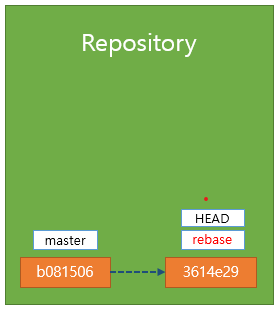

이제 `master`로 돌아가서 `rebase.html`을 아래와 같이 수정 한 다음 저장합니다.

```sh
admin@jinhyeok MINGW64 ~/dev/00010/220 (new_rebase)
$ git checkout master
Switched to branch 'master'
```

```html
<h1>rebase commit</h1>
<h2>updated rebase</h2>
```

이제 `rebase`의 포인트를 이동시켜 보겠습니다.

```sh
admin@jinhyeok MINGW64 ~/dev/00010/220 (master)
$ git commit -am 'rebase update'
[master 86f5a98] rebase update
 1 file changed, 2 insertions(+), 1 deletion(-)
```

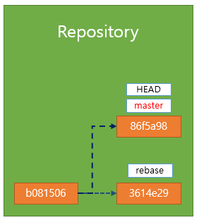

이렇게 분리 된 소스를 이전에는 병합(`merge`)기능을 사용하여 하나의 소스로 병합하였습니다.

하지만 이번에는 `rebase`기능을 사용하여 두 소스를 하나로 합쳐 보도록 하겠습니다.

이전 병합은 중앙이 되는 브랜치에서 병합 할 브랜치를 병합하였습니다.

```sh
# master 브랜치에서 hotfix 브랜치를 병합
# git checkout master
# git merge hotfix
```

하지만 `rebase`는 반대로 `재 결합할 브랜치로 이동하여 결합할 브랜치를 리베이스 하는 것이 다릅니다.

실제 리베이스를 실행해 보도록 하겠습니다.

> git rebase

```sh
admin@jinhyeok MINGW64 ~/dev/00010/220 (master)
$ git checkout new_rebase
Switched to branch 'new_rebase'

admin@jinhyeok MINGW64 ~/dev/00010/220 (new_rebase)
$ git rebase master
Successfully rebased and updated refs/heads/new_rebase.
```

리베이스가 성공적으로 이루어졌습니다.

이제 병합 로그를 확인해 보도록 하겠습니다.

```sh
admin@jinhyeok MINGW64 ~/dev/00010/220 (new_rebase)
$ git log --oneline --graph --all
* 2547e87 (HEAD -> new_rebase) new rebase commit
* 86f5a98 (master) rebase update
* b081506 rebase commit
```

이전 병합과는 다른 유형의 그래프 모양이 나오는 것을 확인 할 수 있습니다.

그림으로 표현하자면 아래와 같습니다.


`rebase`는 `2-way`병합과는 다르게 두 소스를 하나의 소스 라인을 사용하여 병합하는 작업입니다.

이렇게 하나의 라인으로 병합된 작업은 추가적으로 작업이 하나 더 필요합니다.

`log`를 보게 되면 `master`브랜치가 `HEAD`로 붙어 있지 않는 것을 알 수 있습니다.

이럴 경우 `master`를 `HEAD`로 이동시켜야 합니다.

이러한 이동은 `fast-forward` 머지를 사용하여 가능합니다.

```sh
admin@jinhyeok MINGW64 ~/dev/00010/220 (new_rebase)
$ git checkout master
Switched to branch 'master'

admin@jinhyeok MINGW64 ~/dev/00010/220 (master)
$ git merge new_rebase
Updating 86f5a98..2547e87
Fast-forward
 new_rebase.html | 1 +
 1 file changed, 1 insertion(+)
 create mode 100644 new_rebase.html

admin@jinhyeok MINGW64 ~/dev/00010/220 (master)
$ git log --oneline --graph --all
* 2547e87 (HEAD -> master, new_rebase) new rebase commit
* 86f5a98 rebase update
* b081506 rebase commit
```

하나의 `pointer`로 올바르게 병합 된 것을 확인할 수 있습니다.

이로써 기본적인 `git` 사용법을 정리해 보았습니다.

더 공부하기를 원할 경우 `pro git` 책(무료 ***<https://git-scm.com/book/ko/v2>***)을 활용하도록 합니다.

